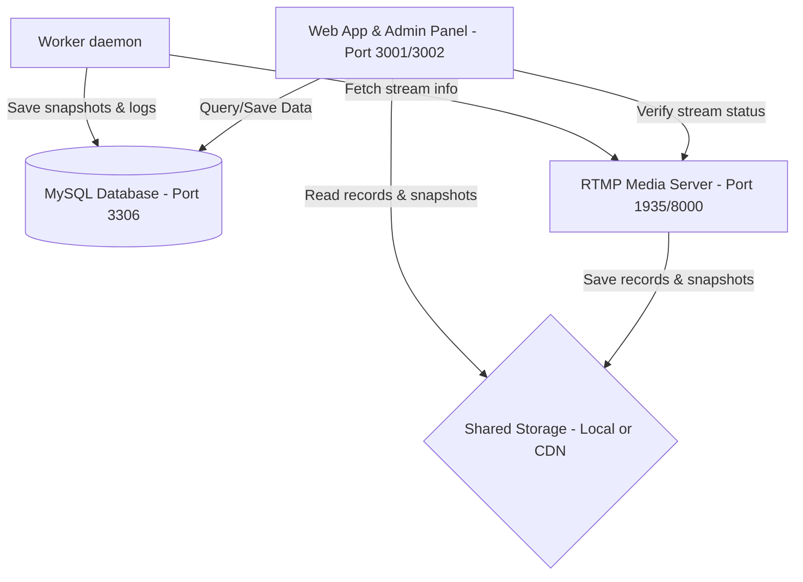

# 📺 ЭтоЯTV — Платформа личного и коллективного телевещания (YaTV Clone)

<p align="center">
  
</p>

<p align="center">
  <strong>Современный опенсорс-клон легендарной интерактивной вещательной платформы ЯTV.</strong><br>
  Проект разработан с использованием передовых методологий разработки (AI-driven / Vibecoding) в тесном сотрудничестве с искусственным интеллектом.
</p>

---

## 📜 О проекте: История, Ностальгия и Вайбкодинг (Vibecoding)

### Что такое ЯTV?
**ЯTV** (ЯТВ) был культовым российским интернет-сервисом конца 2000-х и начала 2010-х годов. Это была первая массовая платформа в Рунете, которая позволила любому человеку стать «телеведущим» собственного канала. Для запуска трансляции требовались лишь веб-камера и браузер. Сервис объединял функции живого вещания, интерактивного текстового чата и социальной сети, создавая неповторимую атмосферу ламповых домашних эфиров, творческих экспериментов и живого общения без жестких рамок современных коммерческих стриминговых гигантов.

### Почему он закрылся?
Со временем технологии ушли вперед, Flash-плееры устарели, а на рынок пришли крупные корпорации (Twitch, YouTube, TikTok). ЯTV не выдержал технологической и финансовой гонки и закрылся, оставив после себя лишь приятные ностальгические воспоминания у целого поколения пользователей рунета.

### Возрождение в Open Source
Проект **ЭтоЯTV** — это попытка воссоздать ту самую атмосферу оригинального ЯTV, но на базе современного технологического стека (Node.js, HTML5, RTMP/HLS вещание). Мы верим, что интернет должен оставаться децентрализованным и свободным, а каждый желающий должен иметь возможность поднять собственную независимую вещательную станцию для своего комьюнити без цензуры и корпоративной рекламы.

> [!TIP]
> **Эксперимент с ИИ и Вайбкодингом (Vibecoding)**
> Этот проект уникален тем, что он является продуктом новой эры разработки программного обеспечения — **вайбкодинга (vibecoding)**. 
> Вся кодовая база проекта, от настройки контейнеров Docker до интерактивных сокет-чатов, систем логирования и интеграций с Telegram API, была создана человеком в тесном творческом союзе с искусственным интеллектом (ИИ-агентами). Вместо написания рутинного кода вручную разработчик сфокусировался на архитектуре, пользовательском опыте, тестировании и общей концепции («вайбе» системы), делегировав написание кода языковым моделям. Этот проект доказывает, что синергия человека и ИИ позволяет собирать сложные, рабочие и масштабируемые продукты в рекордно короткие сроки.

---

## 🏗️ Архитектура системы

Проект построен по модульному принципу и состоит из трех независимых компонентов:



1. **`db`** — Сервис базы данных MySQL 8.0, обеспечивающий хранение всех учетных записей, настроек, записей, логов и жалоб.
2. **`rtmp`** — Медиа-сервер (на базе Node-Media-Server) для приема RTMP-потоков и их нарезки в HLS (.m3u8), а также **фоновый воркер (worker)** для обслуживания трансляций (создание снапшотов, мониторинг эфиров).
3. **`web`** — Основное веб-приложение платформы (клиентская часть, плееры, студия вещания) на порту `3001` и независимая панель администратора/модератора на порту `3002`.

---

## 📂 Структура репозитория

```text
├── db/                       # Модуль базы данных (MySQL)
│   ├── docker-compose.yml    # Конфигурация контейнера БД
│   └── .env.example          # Шаблон настроек базы данных
│
├── rtmp/                     # Модуль вещания (RTMP / HLS)
│   ├── rtmp/                 # Код RTMP-сервера
│   ├── worker/               # Воркер для создания снапшотов и обслуживания эфиров
│   ├── docker-compose.yml    # Запуск медиа-сервера и воркера
│   └── .env.example          # Настройки воркера и RTMP
│
└── web/                      # Модуль веб-интерфейса и админки
    ├── app/                  # Бэкенд и фронтенд основного сайта (Express + EJS)
    ├── admin/                # Панель управления (логи, реклама, модерация)
    ├── docker-compose.yml    # Запуск сайта (3001) и админки (3002)
    └── .env.example          # Настройки почты, hCaptcha, сессий и Telegram
```

---

## 🚀 Быстрый запуск (Docker Compose)

Запуск каждого модуля осуществляется отдельно в соответствии с порядком инициализации сервисов:

### Шаг 1. Развертывание Базы Данных (db)
```bash
cd db
cp .env.example .env
docker compose up -d
```

### Шаг 2. Развертывание Медиа-сервера (rtmp)
```bash
cd ../rtmp
cp .env.example .env
docker compose up -d --build
```

### Шаг 3. Развертывание Веб-приложения (web)
```bash
cd ../web
cp .env.example .env
docker compose up -d --build
```

---

## 🌐 Сетевая архитектура: Локальное хранение vs CDN

В зависимости от планируемой нагрузки проект можно развернуть в двух режимах:

| Параметр | Режим 1: Локальное хранение (Development) | Режим 2: Использование CDN / Сетевого диска (Production) |
| :--- | :--- | :--- |
| **Принцип работы** | Все файлы пишутся локально и раздаются силами Express-сервера. | Статика загружается на общий SMB/NFS-диск и раздается Nginx-CDN сервером. |
| **Настройка `CDN_BASE_URL`** | Оставить пустым (`CDN_BASE_URL=`) | Указать домен CDN (`CDN_BASE_URL=https://cdn.yourdomain.com`) |
| **Параметр `MEDIA_STORAGE_PATH`** | `/app/public` (внутри проекта) | Путь монтирования диска на сервере (например, `/mnt/smb_media/public`) |
| **Эффективность** | Подходит для тестирования и одного разработчика. | Снимает нагрузку с Node.js, обеспечивая моментальную отдачу видео и изображений. |

---

## 🤖 Интерактивные Telegram-уведомления

Модуль `web` содержит систему оповещения персонала в Telegram о действиях пользователей:

1. Укажите токен бота в `web/.env` (`TELEGRAM_BOT_TOKEN`, `TELEGRAM_BOT_USERNAME`).
2. В админ-панели перейдите в **«Личные настройки»** и нажмите **«Привязать Telegram»**.
3. Запустите бота в открывшемся диалоге. Страница настроек сама отследит привязку (через AJAX) и переключится в режим управления.
4. Выберите типы событий для подписки:
   * 👤 Регистрация пользователей
   * 🆕 Создание контента (каналы, записи, новости)
   * 📺 Запуск трансляций и автопилотов
   * ❌ Удаление контента (нарушения, жалобы)

---

## 🛡️ Настройка Nginx в качестве Reverse Proxy (Production)

Для развертывания проекта в продакшене рекомендуется использовать веб-сервер Nginx в качестве обратного прокси (Reverse Proxy). Это позволит настроить защищенное HTTPS-соединение (SSL) и оптимизировать кэширование видеопотоков.

Ниже приведены примеры типовых конфигураций виртуальных хостов для Nginx:

### 1. Основной сайт (yourdomain.com ➔ port 3001)
```nginx
server {
    server_name yourdomain.com www.yourdomain.com;

    location / {
        # Перенаправляем на IP-адрес контейнера веб-приложения (например, 192.168.1.4) или localhost
        proxy_pass http://192.168.1.4:3001;
        proxy_http_version 1.1;
        
        # Поддержка WebSocket (крайне важно для чата на Socket.io!)
        proxy_set_header Upgrade $http_upgrade;
        proxy_set_header Connection "upgrade";
        
        proxy_set_header Host $host;
        proxy_set_header X-Real-IP $remote_addr;
        proxy_set_header X-Forwarded-For $proxy_add_x_forwarded_for;
        proxy_set_header X-Forwarded-Proto $scheme;

        # Разрешаем CORS
        add_header 'Access-Control-Allow-Origin' '*' always;
        add_header 'Access-Control-Allow-Methods' 'GET, POST, OPTIONS' always;
        add_header 'Access-Control-Allow-Headers' 'DNT,User-Agent,X-Requested-With,If-Modified-Since,Cache-Control,Content-Type,Range' always;
        add_header 'Access-Control-Expose-Headers' 'Content-Length,Content-Range' always;
    }

    listen 443 ssl;
    ssl_certificate /etc/letsencrypt/live/yourdomain.com/fullchain.pem;
    ssl_certificate_key /etc/letsencrypt/live/yourdomain.com/privkey.pem;
}
```

### 2. Панель управления (admin.yourdomain.com ➔ port 3002)
```nginx
server {
    server_name admin.yourdomain.com;

    location / {
        # Перенаправляем на порт панели администратора
        proxy_pass http://192.168.1.4:3002;
        proxy_set_header Host $host;
        proxy_set_header X-Real-IP $remote_addr;
        proxy_set_header X-Forwarded-For $proxy_add_x_forwarded_for;
        proxy_set_header X-Forwarded-Proto $scheme;
    }

    listen 443 ssl;
    ssl_certificate /etc/letsencrypt/live/yourdomain.com/fullchain.pem;
    ssl_certificate_key /etc/letsencrypt/live/yourdomain.com/privkey.pem;
}
```

### 3. Раздача статики и CDN (cdn.yourdomain.com ➔ Direct Static)
При использовании сетевого хранилища Nginx может раздавать статику (картинки, записи эфиров) напрямую с диска без проксирования в Node.js, что дает максимальную производительность:
```nginx
server {
    server_name cdn.yourdomain.com;
    root /mnt/smb_media/public; # Путь к смонтированному сетевому диску статики

    # CORS заголовки необходимы, чтобы плеер на основном сайте мог загружать видео и ассеты
    add_header 'Access-Control-Allow-Origin' '*' always;
    add_header 'Access-Control-Allow-Methods' 'GET, OPTIONS' always;
    add_header 'Access-Control-Allow-Headers' 'DNT,User-Agent,X-Requested-With,If-Modified-Since,Cache-Control,Content-Type,Range' always;
    add_header 'Access-Control-Expose-Headers' 'Content-Length,Content-Range' always;

    location / {
        if ($request_method = 'OPTIONS') {
            add_header 'Access-Control-Allow-Origin' '*';
            add_header 'Access-Control-Allow-Methods' 'GET, OPTIONS';
            add_header 'Access-Control-Allow-Headers' 'DNT,User-Agent,X-Requested-With,If-Modified-Since,Cache-Control,Content-Type,Range';
            add_header 'Access-Control-Max-Age' 1728000;
            add_header 'Content-Type' 'text/plain; charset=utf-8';
            add_header 'Content-Length' 0;
            return 204;
        }
        
        try_files $uri $uri/ =404;
        expires 30d; # Кэшируем статику
        add_header Cache-Control "public, no-transform" always;
    }

    # Защита резервных копий
    location /backups/ {
        deny all;
    }

    listen 443 ssl;
    ssl_certificate /etc/letsencrypt/live/cdn.yourdomain.com/fullchain.pem;
    ssl_certificate_key /etc/letsencrypt/live/cdn.yourdomain.com/privkey.pem;
}
```

### 4. RTMP/HLS Медиа-сервер (rtmp.yourdomain.com ➔ port 8000)
```nginx
server {
    server_name rtmp.yourdomain.com;

    location / {
        # Перенаправляем на IP-адрес медиа-сервера RTMP (например, 192.168.1.5)
        proxy_pass http://192.168.1.5:8000;
        proxy_http_version 1.1;
        proxy_set_header Upgrade $http_upgrade;
        proxy_set_header Connection "upgrade";
        proxy_set_header Host $host;
        proxy_set_header X-Real-IP $remote_addr;
        proxy_set_header X-Forwarded-For $proxy_add_x_forwarded_for;
    }

    listen 443 ssl;
    ssl_certificate /etc/letsencrypt/live/yourdomain.com/fullchain.pem;
    ssl_certificate_key /etc/letsencrypt/live/yourdomain.com/privkey.pem;
}
```

---

## ❓ Часто задаваемые вопросы и решение проблем (FAQ)

> [!CAUTION]
> ### 1. Ошибка подключения к базе данных (`ECONNREFUSED` / `Access Denied`)
> * **Симптом**: Приложение падает с ошибкой подключения к БД при старте.
> * **Решение**:
>   * Убедитесь, что сервер MySQL запущен и принимает подключения.
>   * Если вы запускаете проект **в Docker**: хост базы данных (`DB_HOST` в `.env`) не должен быть равен `localhost` или `127.0.0.1` (так как внутри контейнера это указывает на сам контейнер). Используйте IP-адрес вашего сервера базы данных (например, `192.168.x.x`) или имя сервиса БД в Docker Network.
>   * Проверьте правильность логина и пароля в `.env`.

> [!WARNING]
> ### 2. Порт уже занят (`EADDRINUSE`)
> * **Симптом**: Логи пишут `Error: listen EADDRINUSE: address already in use :::3001` (или `3002`).
> * **Решение**:
>   * Порты 3001 или 3002 уже заняты другими процессами на хосте.
>   * Проверьте занятые порты: `netstat -tulpn | grep 3001`.
>   * Убедитесь, что у вас не запущены фоновые копии Node.js приложений (`killall node`).
>   * Измените порт в `.env` (например, `PORT=3003`) или перенастройте проброс портов в `docker-compose.yml`.

> [!IMPORTANT]
> ### 3. Ошибки обработки видео и снапшотов (FFmpeg)
> * **Симптом**: Не создаются превью каналов (скриншоты) или не проигрываются записи.
> * **Решение**:
>   * Приложению необходим установленный системный пакет **FFmpeg** и **FFprobe**.
>   * Установите их локально:
>     * Ubuntu/Debian: `sudo apt update && sudo apt install -y ffmpeg`
>     * CentOS/RHEL: `sudo dnf install -y ffmpeg`
>     * В Docker контейнерах зависимости уже установлены через базовые образы Node-Alpine.

> [!NOTE]
> ### 4. Ошибка Telegram Polling Conflict (409 Conflict)
> * **Симптом**: В логах админки спамит ошибка `Telegram polling error: Request failed with status code 409 (Conflict: can't use getUpdates while webhook is active...)`.
> * **Решение**:
>   * Убедитесь, что вы не используете этот же токен бота на другом сервере или локальной машине разработки одновременно. На один токен может быть запущен только один процесс `getUpdates`.
>   * Если вы ранее настраивали вебхук для этого бота, сбросьте его, сделав HTTP-запрос в браузере: `https://api.telegram.org/bot<ВАШ_ТОКЕН>/deleteWebhook`.

> [!IMPORTANT]
> ### 5. Браузер блокирует плеер трансляции (Смешанный контент / Mixed Content)
> * **Симптом**: Сайт работает по HTTPS, но трансляция в плеере не запускается (ошибка в консоли браузера: `Blocked loading mixed active content`).
> * **Решение**:
>   * В `.env` параметр `RTMP_STREAM_URL` должен быть настроен на HTTPS-домен вашего медиа-сервера (с установленным SSL-сертификатом).
