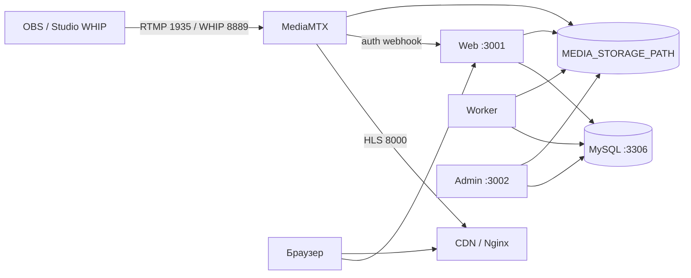

# ЭтоЯTV

<p align="center">
  
</p>

<p align="center">
  <strong>Платформа личного и коллективного телевещания</strong><br>
  Опенсорс-наследник атмосферы ЯTV: каналы, live RTMP/HLS, записи, чат, студия, админка.
</p>

<p align="center">
  <a href="https://etoyatv.top">etoyatv.top</a> ·
  <a href="#быстрый-старт-docker">Быстрый старт</a> ·
  <a href="#подводные-камни">Подводные камни</a>
</p>

---

## О проекте

**ЯTV** был культовым рунет-сервисом конца 2000-х / начала 2010-х: свой «телеканал», live + чат + соцсеть без тяжёлой корпоративной рамки. **ЭтоЯTV** воссоздаёт эту модель на современном стеке:

- **Node.js / Express / EJS** — сайт и админка  
- **MySQL 8** — пользователи, каналы, записи, модерация  
- **MediaMTX** — ingest RTMP / WHIP → HLS  
- **FFmpeg worker** — VOD HLS, снапшоты, фоновые задачи  
- **Socket.io** — чат  
- **i18n** — RU / EN / UA / BY (Weblate + опциональный MT для UGC)

Репозиторий — **чистый снимок кода** без боевых `.env`, без `mysql_data`, без пользовательских загрузок. Образцы медиа-дерева — в [`samples/media`](samples/media).

---

## Архитектура


```mermaid
flowchart LR
  OBS[OBS / Studio WHIP] -->|RTMP 1935 / WHIP 8889| MTX[MediaMTX]
  MTX -->|HLS 8000| CDN[CDN / Nginx]
  MTX -->|auth webhook| WEB[Web :3001]
  WEB --> DB[(MySQL :3306)]
  WRK[Worker] --> DB
  WRK --> DISK[(MEDIA_STORAGE_PATH)]
  MTX --> DISK
  WEB --> DISK
  ADM[Admin :3002] --> DB
  ADM --> DISK
  USER[Браузер] --> WEB
  USER --> CDN
```

| Каталог | Назначение | Порты |
|--------|------------|-------|
| `db/` | MySQL 8 | `3306` |
| `rtmp/` | MediaMTX + worker | `1935` RTMP, `8000` HLS, `8889` WebRTC/WHIP, `8189` ICE, `9997` API |
| `web/` | Сайт (`app`) + админка (`admin`) | `3001`, `3002` |
| `samples/media/` | Пример дерева CDN/диска | — |
| `scripts/` | Сборка бандлов плеера/студии | — |

> Раньше в публичном репо был Node-Media-Server. Сейчас ingest/HLS — **MediaMTX** (`rtmp/mediamtx.yml` + `entrypoint.sh` / `on_ready.sh`).

---

## Структура репозитория

```text
├── db/                     # docker-compose MySQL + .env.example
├── rtmp/
│   ├── mediamtx.yml        # шаблон MediaMTX
│   ├── entrypoint.sh
│   ├── on_ready.sh         # hook при старте публикаций
│   ├── worker/             # VOD / снапшоты / claim задач
│   └── docker-compose.yml
├── web/
│   ├── app/                # Express: routes, views, jobs
│   ├── admin/              # модерация, жалобы, transfers
│   ├── public/             # UI-статика (css/js/images)
│   ├── locales/            # переводы Weblate
│   ├── docker-compose.yml
│   └── .env.example
├── samples/media/          # образец MEDIA_STORAGE_PATH
├── scripts/                # bundle-player.js, bundle-studio.js
├── .env.example            # сводный справочник переменных
└── README.md
```

---

## Требования

- Docker + Docker Compose v2  
- Для хоста без Docker (редко): Node.js 20+, MySQL 8, FFmpeg  
- Открытые порты (или reverse proxy): `3001`, `3002`, `3306`, `1935`, `8000`, `8889`, `8189/udp+tcp`  
- Диск/каталог под медиа (локально можно `samples/media`)

---

## Быстрый старт (Docker)

Порядок важен: сначала БД, потом медиа, потом web.

### 1. Клон

```bash
git clone https://github.com/etoyatv/etoyatv.git
cd etoyatv
```

### 2. База данных

```bash
cd db
cp .env.example .env
# отредактируйте пароли
docker compose up -d
```

Дождитесь готовности MySQL (`docker compose logs -f db`).

### 3. MediaMTX + worker

```bash
cd ../rtmp
cp .env.example .env
```

В `rtmp/.env` укажите:

- те же `DB_*`, что в `db/.env`  
- `MEDIA_STORAGE_PATH` — абсолютный путь к `samples/media` (или своему диску)  
- `WEB_SERVER_IP` / `AUTH_WEB_IP` — IP/hostname веб-приложения **с точки зрения контейнера MediaMTX**  
- сильные `RTMP_API_USER` / `RTMP_API_PASS`

```bash
docker compose up -d --build
```

### 4. Web + Admin

```bash
cd ../web
cp .env.example .env
```

Обязательно задайте **уникальный** `SESSION_SECRET` (приложение **упадёт**, если оставлен дефолт вроде `etoyatv_secret_key`).  
Согласуйте `DB_*`, `MEDIA_STORAGE_PATH`, `RTMP_*`, `APP_URL`, `ADMIN_URL`.

```bash
docker compose up -d --build
```

Откройте:

- сайт: http://localhost:3001  
- админка: http://localhost:3002  

Схема БД поднимается миграциями при старте приложения (см. `web/config/migrations.js`).

---

## Переменные окружения

Краткий обзор — в корневом [`.env.example`](.env.example). Рабочие файлы:

| Файл | Сервис |
|------|--------|
| `db/.env` | MySQL |
| `rtmp/.env` | MediaMTX + worker |
| `web/.env` | app + (через mount) admin |

Критичные ключи:

| Ключ | Зачем |
|------|--------|
| `SESSION_SECRET` | Подпись сессий; слабый дефолт запрещён |
| `DB_PASSWORD` | MySQL |
| `RTMP_API_USER` / `RTMP_API_PASS` | API MediaMTX + auth |
| `MEDIA_STORAGE_PATH` | Общий корень медиа |
| `CDN_BASE_URL` | Пусто = раздача с приложения; иначе URL CDN |
| `APP_URL` / `ADMIN_URL` | Cookie, редиректы, ссылки в письмах |
| `LIVE_ABR_ENABLED` | Live ABR (по умолчанию `0`) |

---

## Медиа и CDN

Два режима:

| | Dev / один сервер | Production + CDN |
|--|-------------------|------------------|
| `MEDIA_STORAGE_PATH` | `.../samples/media` | `/mnt/smb_media/public` |
| `CDN_BASE_URL` | пусто | `https://cdn.yourdomain.com` |
| Раздача | Express / локальные volume | Nginx с `root` на диск |

Дерево каталогов описано в [`samples/media/README.md`](samples/media/README.md).

**Важно:** UI-скрипты (`player.js`, `toast.js`, `studio.js`) в проде часто лежат **на CDN** (`{MEDIA}/js/`). После деплоя кода синхронизируйте их с диска репозитория, иначе браузер будет тянуть старую версию.

---

## OBS / Studio

### Классический RTMP (OBS)

- Сервер: значение `RTMP_INGEST_URL` без ключа, обычно `rtmp://kctv.yourdomain.com:1935/live`  
- Ключ потока: выдаётся в панели канала  

### Браузерная студия (WHIP)

MediaMTX слушает WebRTC на `:8889`, ICE на `:8189` (в проде у вас может быть другой порт, например `8190` — смотрите `mediamtx.yml` и проброс в `docker-compose.yml`).  
Пробросьте UDP/TCP ICE наружу, иначе WHIP «подключается», но медиа не идёт.

---

## Nginx (кратко)

Нужны минимум четыре vhost’а (HTTPS + Let’s Encrypt):

1. **Сайт** → `proxy_pass` на `:3001`, **обязательно** WebSocket (`Upgrade` / `Connection`) для чата.  
2. **Админка** → `:3002`.  
3. **CDN** → `root` на `MEDIA_STORAGE_PATH`, CORS для плеера, запрет `private/` и бэкапов.  
4. **HLS / MediaMTX HTTP** → `:8000` (и отдельно TCP 1935 для ingest, обычно без TLS на самом RTMP).

Примеры конфигов из старой документации совместимы по идее; IP сервисов подставьте свои.

---

## i18n

- UI-строки: `web/locales/` (Weblate).  
- Смена языка на сайте включает серверный перевод оставшегося кириллического UGC (где настроено).  
- Ручные кнопки «Translate» в интерфейсе **не используются** — не возвращайте их в CDN-копию `toast.js`.

---

## Подводные камни

### 1. `DB_HOST=127.0.0.1` внутри контейнера

Из контейнера `127.0.0.1` — это **сам контейнер**, не хост. Укажите IP хоста, имя сервиса в общей docker-network или `host.docker.internal` (где поддерживается).

### 2. Anonymous volume `node_modules`

В `web/docker-compose.yml` есть `- /app/node_modules`. После добавления npm-зависимостей (например `archiver`) **старый volume** может оставить контейнер без новых пакетов → `Cannot find module '...'`.

Лечение:

```bash
docker compose rm -sf app
docker volume ls   # найти анонимный volume при необходимости
docker compose up -d --build --force-recreate app
```

### 3. Секреты без дефолтов

`validateEnv` требует `SESSION_SECRET` и `DB_PASSWORD` и отвергает слабый `SESSION_SECRET=etoyatv_secret_key`. Не полагайтесь на старые дефолты в compose.

### 4. Устаревший CDN JS

Симптом: на сайте «как будто старый код», кнопки Translate, баги плеера.  
Проверка: сравните `web/public/js/player.js` с `{MEDIA_STORAGE_PATH}/js/player.js`. Скопируйте и выставьте права, читаемые nginx (`0644`).

### 5. ICE / WHIP порты

Не открыли `8189` (или ваш prod-порт) UDP/TCP → студия в браузере молчит. MediaMTX `webrtcAdditionalHosts` должен содержать публичный hostname.

### 6. Mixed Content

Сайт по HTTPS, а `RTMP_STREAM_URL` на `http://` → браузер режет HLS. Только HTTPS для стрима в проде.

### 7. Auth webhook MediaMTX → web

`AUTH_WEB_IP` / `WEB_SERVER_IP` должны быть достижимы **из контейнера rtmp**. Неверный IP → публикации отвергаются или не закрываются.

### 8. SSHFS / сетевой диск

При зависаниях SSHFS MediaMTX может копить zombie ffmpeg. В образе включены `init: true` и watchdog; всё равно следите за здоровьем mount’а.

### 9. Live ABR

`LIVE_ABR_ENABLED=1` включает доп. транскод (CPU). По умолчанию выключен — так и оставляйте, пока не посчитаете нагрузку.

### 10. Два контура staging/prod

Не копируйте staging `.env` в prod. Порты ICE, домены (`APP_URL`, CDN, `kctv.*`) и `MEDIA_STORAGE_PATH` у контуров **разные**.

### 11. Права на файлы CDN

Файлы с `0700` nginx (`www-data`) не отдаст (403). После `cp` проверяйте `chmod 644` на публичные ассеты.

---

## Разработка без полного CDN

```bash
# web/.env и rtmp/.env
MEDIA_STORAGE_PATH=/absolute/path/to/etoyatv/samples/media
CDN_BASE_URL=
APP_URL=http://localhost:3001
ADMIN_URL=http://localhost:3002
```

Код `web/` монтируется в контейнер (`./:/app`) — правки views/js видны сразу; для `server.js` обычно нужен recreate контейнера.

Сборка клиентских бандлов (если меняли исходники плеера/студии):

```bash
node scripts/bundle-player.js
node scripts/bundle-studio.js
```

---

## Лицензия

См. [LICENSE](LICENSE).

---

## Ссылки

- Боевой сайт: [etoyatv.top](https://etoyatv.top)  
- Репозиторий: [github.com/etoyatv/etoyatv](https://github.com/etoyatv/etoyatv)

Вопросы по развёртыванию и PR приветствуются.
