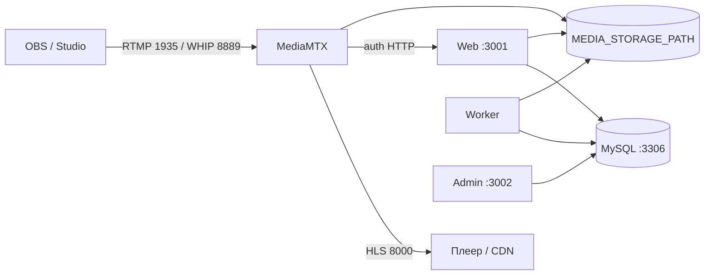

# ЭтоЯTV

<p align="center">
  
</p>

<p align="center">
  <strong>Платформа личного и коллективного телевещания</strong><br>
  Опенсорс-наследник атмосферы ЯTV: каналы, live RTMP/HLS, записи, чат, студия, админка.
</p>

<p align="center">
  <a href="https://etoyatv.top">etoyatv.top</a> ·
  <a href="#карта-сервисов-что-поднимать">Карта сервисов</a> ·
  <a href="#пошаговый-запуск-для-новичка">Пошаговый запуск</a> ·
  <a href="#карта-файлов-и-папок-что-где-править">Карта файлов</a> ·
  <a href="#weblate-и-переводы-ui">Weblate</a> ·
  <a href="#подводные-камни">Подводные камни</a>
</p>

---

## Оглавление

1. [О проекте](#о-проекте)
2. [Сделано с участием ИИ](#сделано-с-участием-ии)
3. [Карта сервисов: что поднимать](#карта-сервисов-что-поднимать)
4. [Архитектура простыми словами](#архитектура-простыми-словами)
5. [Что нужно установить заранее](#что-нужно-установить-заранее)
6. [Пошаговый запуск для новичка](#пошаговый-запуск-для-новичка)
7. [Проверка: что всё ожило](#проверка-что-всё-ожило)
8. [Первый пользователь и админка](#первый-пользователь-и-админка)
9. [Канал и первая трансляция (OBS)](#канал-и-первая-трансляция-obs)
10. [Переменные окружения (подробно)](#переменные-окружения-подробно)
11. [Медиа, CDN и samples](#медиа-cdn-и-samples)
12. [Weblate и переводы UI](#weblate-и-переводы-ui)
13. [LibreTranslate / машинный перевод UGC](#libretranslate--машинный-перевод-ugc)
14. [Выход в интернет (Nginx + HTTPS)](#выход-в-интернет-nginx--https)
15. [Студия в браузере (WHIP)](#студия-в-браузере-whip)
16. [Подводные камни](#подводные-камни)
17. [Частые ошибки и что делать](#частые-ошибки-и-что-делать)
18. [Остановка и обновление](#остановка-и-обновление)
19. [Карта файлов и папок (что где править)](#карта-файлов-и-папок-что-где-править)
20. [Ссылки](#ссылки)

---

## О проекте

**ЯTV** — культовый рунет-сервис конца 2000-х / начала 2010-х: свой «телеканал», live + чат + соцсеть. **ЭтоЯTV** воссоздаёт эту модель на современном стеке:

| Часть | Технологии |
|-------|------------|
| Сайт и админка | Node.js, Express, EJS, Socket.io |
| База | MySQL 8 |
| Live-видео | **MediaMTX** (RTMP / WHIP → HLS) |
| Фоновые задачи | FFmpeg worker (VOD HLS, снапшоты) |
| Языки UI | RU / EN / UA / BY (`web/locales`) |

Репозиторий — **чистый снимок**: без боевых `.env`, без дампа БД, без чужих загрузок. Для локального старта есть [`samples/media`](samples/media).

Официальный основной инстанс: [etoyatv.top](https://etoyatv.top).

---

## Сделано с участием ИИ

Кодовая база ЭтоЯTV создавалась и развивалась **в синергии человека и ИИ-агентов** (вайбкодинг / AI-assisted development): человек задаёт цели, архитектуру и приёмку, агенты пишут и правят код, документацию и инфраструктурные куски.

В работе над проектом (в разное время) участвовали, в частности:

| Агент / инструмент | Роль |
|--------------------|------|
| **Cursor Agent (Composer)** | основной ассистент в IDE: фичи, рефакторинг, безопасность, деплой-скрипты, этот README |
| **Antigravity** | ранняя автоматизация и CI/CD-ориентированные правки в истории репозитория |
| **Google Gemini** | отдельные сессии помощи по коду и конфигурации |
| **Другие LLM-ассистенты** | точечные правки, переводы, черновики |

ИИ **не заменяет** ответственность мейнтейнера: секреты, прод-решения и финальный review — за людьми.

---

## Карта сервисов: что поднимать

Чтобы ничего не забыть — полный чеклист. Всё из колонки **обязательно** есть в этом репозитории. Weblate и LibreTranslate — **отдельные** Docker-стеки (в репо только инструкция).

### Обязательно (без этого сайт/эфир не живут)

| # | Сервис | Где в репо | Порты | Зачем |
|---|--------|------------|-------|--------|
| 1 | **MySQL** | `db/` | `3306` | пользователи, каналы, записи, сессии |
| 2 | **MediaMTX** | `rtmp/` | `1935`, `8000`, `8889`, `8189`, `9997` | приём эфира → HLS |
| 3 | **Worker** | `rtmp/worker` (тот же compose) | — | VOD HLS, снапшоты, фоновые задачи |
| 4 | **Web app** | `web/` → service `app` | `3001` | сайт, чат, студия, API |
| 5 | **Admin** | `web/` → service `admin` | `3002` | модерация, жалобы, staff |
| 6 | **Медиа-диск** | `samples/media/` или свой путь | — | аватары, записи, HLS, JS на CDN |

Порядок запуска: **db → rtmp → web** (см. [пошаговый запуск](#пошаговый-запуск-для-новичка)).

### Для нормального продакшена (очень желательно)

| Сервис | Зачем | Как |
|--------|--------|-----|
| **Nginx (или Caddy) reverse proxy** | HTTPS, домены, WebSocket, отдача CDN | [раздел Nginx](#выход-в-интернет-nginx--https) |
| **CDN vhost** | разгрузка Node от статики/видео | `root` = `MEDIA_STORAGE_PATH` |
| **SMTP** | сброс пароля, письма | `SMTP_*` в `web/.env` |
| **Открытые порты** | `443`, `1935`, ICE `8189/udp+tcp` | файрвол / роутер |
| **Бэкапы** | `db/mysql_data` + медиа-диск | cron / снапшоты |

### Опционально (сайт без них стартует)

| Сервис | Зачем | Когда поднимать |
|--------|--------|-----------------|
| **Weblate** | веб-UI для перевода `web/locales/*.json` | если нужны community/переводчики; [инструкция](docs/weblate.md) |
| **LibreTranslate** | безлимитный MT для UGC при смене языка | если не хотите квоты MyMemory |
| **hCaptcha** | антибот на регистрации | публичный инстанс в интернете |
| **Telegram-бот** | алерты персоналу | удобство модерации |
| **Boosty** | подписки | если используете интеграцию |
| **Live ABR** | второе качество live | только если хватает CPU (`LIVE_ABR_ENABLED=1`) |

### Не входит в этот репозиторий

На официальном инстансе ещё крутятся внутренние штуки (Forgejo/git, board и т.п.) — **для своего ЭтоЯTV они не нужны**. Достаточно таблицы выше.

```text
Минимум для «у себя дома»:
  [MySQL] + [MediaMTX+worker] + [web+admin] + [samples/media]

Полноценный публичный инстанс:
  минимум
  + Nginx/HTTPS + CDN
  + SMTP (+ желательно hCaptcha)
  + Weblate          ← переводы UI
  + LibreTranslate   ← MT для UGC (или жить на MyMemory)
```

---

## Архитектура простыми словами

Проект — **три отдельных Docker Compose** (три папки). Их нужно поднимать **по очереди**:

```text
db/     →  MySQL на порту 3306
rtmp/   →  MediaMTX (эфир) + worker (обработка записей)
web/    →  сайт :3001 + админка :3002
```

Они **не в одной docker-сети**. Поэтому из контейнеров `web`/`rtmp` адрес MySQL — это не `localhost`, а **IP хоста** (машины, где крутится Docker). То же для связи MediaMTX → сайт (auth webhook).


```mermaid
flowchart LR
  OBS[OBS / Studio] -->|RTMP 1935 / WHIP 8889| MTX[MediaMTX]
  MTX -->|HLS 8000| Player[Плеер / CDN]
  MTX -->|auth HTTP| WEB[Web :3001]
  WEB --> DB[(MySQL :3306)]
  WRK[Worker] --> DB
  WRK --> DISK[(MEDIA_STORAGE_PATH)]
  MTX --> DISK
  WEB --> DISK
  ADM[Admin :3002] --> DB
```

| Каталог | Что делает | Порты наружу |
|---------|------------|--------------|
| `db/` | MySQL 8 | `3306` |
| `rtmp/` | MediaMTX + worker | `1935`, `8000`, `8889`, `8189/udp+tcp`, `9997` |
| `web/` | Сайт + админка | `3001`, `3002` |
| `samples/media/` | Образец диска под медиа | — |

> Старые версии репозитория использовали Node-Media-Server. Сейчас только **MediaMTX**.

---

## Что нужно установить заранее

### 1. Docker и Compose v2

**Ubuntu / Debian:**

```bash
sudo apt update
sudo apt install -y docker.io docker-compose-v2
sudo usermod -aG docker "$USER"
# выйдите из SSH/терминала и зайдите снова, чтобы группа docker применилась
docker version
docker compose version
```

**Windows / macOS:** поставьте [Docker Desktop](https://www.docker.com/products/docker-desktop/), дождитесь зелёного статуса.

Проверка:

```bash
docker run --rm hello-world
```

### 2. Git

```bash
sudo apt install -y git    # Linux
# или Git for Windows / Xcode CLI на macOS
```

### 3. Свободные порты

На машине не должны быть заняты: `3001`, `3002`, `3306`, `1935`, `8000`, `8889`, `8189`, `9997`.

```bash
# Linux: кто слушает порт (пример)
ss -tulpn | grep -E '3001|3306|1935|8000' || true
```

### 4. Минимум железа

Для теста хватит 2 CPU / 4 GB RAM. Live ABR (`LIVE_ABR_ENABLED=1`) жрёт CPU — новичкам оставьте `0`.

---

## Пошаговый запуск для новичка

Ниже — сценарий **«всё на одной машине, без CDN и без своего домена»**. Цель: открыть сайт в браузере на `http://localhost:3001`.

### Шаг 0. Клонируем репозиторий

```bash
git clone https://github.com/etoyatv/etoyatv.git
cd etoyatv
pwd
# запомните этот путь, например: /home/you/etoyatv
```

Дальше `REPO` = этот абсолютный путь.

```bash
export REPO="$(pwd)"
echo "$REPO"
```

### Шаг 1. Узнаём IP хоста для Docker

Контейнеры ходят в MySQL и друг к другу через **IP хоста**.

**Linux (чаще всего):**

```bash
# IP docker-bridge (часто работает для контейнеров → сервисы на хосте)
ip -4 addr show docker0 | awk '/inet /{print $2}' | cut -d/ -f1
# часто: 172.17.0.1
```

Или LAN-IP машины:

```bash
hostname -I | awk '{print $1}'
```

**Docker Desktop (Windows/macOS):** обычно `host.docker.internal`.

Запомните значение как `HOST_IP` (ниже в примерах — `172.17.0.1`).

```bash
export HOST_IP=172.17.0.1   # подставьте своё
```

### Шаг 2. Поднимаем MySQL (`db/`)

```bash
cd "$REPO/db"
cp .env.example .env
nano .env   # или code / vim
```

Минимальный `db/.env`:

```env
DB_HOST=localhost
DB_USER=yatv_user
DB_PASSWORD=MyStrongDbPass_ChangeMe
DB_NAME=yatv
MYSQL_ROOT_PASSWORD=MyStrongRootPass_ChangeMe
```

> Пароли придумайте сами и **запишите**. Те же `DB_USER` / `DB_PASSWORD` / `DB_NAME` потом скопируете в `web/.env` и `rtmp/.env`.

Запуск:

```bash
docker compose up -d
docker compose ps
docker compose logs --tail=30 db
```

Ждите строку вроде `ready for connections`. Данные лежат в `db/mysql_data/` (в git не коммитится).

Проверка с хоста (если есть клиент):

```bash
docker compose exec db mysqladmin ping -uroot -p"$MYSQL_ROOT_PASSWORD" || true
```

### Шаг 3. Готовим папку медиа

Для локалки используйте образец:

```bash
ls "$REPO/samples/media"
# images/, uploads/, js/, tvsnapshots/, private/, ...
```

Абсолютный путь к медиа:

```bash
export MEDIA="$REPO/samples/media"
echo "$MEDIA"
```

Права на запись (если Docker ругается на permission denied):

```bash
chmod -R a+rwX "$MEDIA"
```

### Шаг 4. Поднимаем MediaMTX + worker (`rtmp/`)

```bash
cd "$REPO/rtmp"
cp .env.example .env
nano .env
```

Пример `rtmp/.env` для локалки:

```env
DB_HOST=172.17.0.1
DB_USER=yatv_user
DB_PASSWORD=MyStrongDbPass_ChangeMe
DB_NAME=yatv

MEDIA_STORAGE_PATH=/home/you/etoyatv/samples/media

RTMP_API_USER=mediamtx_api
RTMP_API_PASS=MyStrongRtmpApiPass_ChangeMe

# IP сайта (web:3001) С ТОЧКИ ЗРЕНИЯ контейнера MediaMTX
WEB_SERVER_IP=172.17.0.1
AUTH_WEB_IP=172.17.0.1

LIVE_ABR_ENABLED=0
LIVE_ABR_THREADS=1
MTX_WATCHDOG_INTERVAL=20
MTX_WATCHDOG_TIMEOUT=3
MTX_WATCHDOG_MAX_FAILS=3
```

Подставьте свои `HOST_IP` и абсолютный `MEDIA`.

В `mediamtx.yml` для локалки можно оставить `kctv.yourdomain.com` или заменить на `127.0.0.1` / hostname машины в `webrtcAdditionalHosts` — для чистого RTMP через OBS это не критично; для браузерной студии (WHIP) — важно.

Запуск:

```bash
docker compose up -d --build
docker compose ps
docker compose logs --tail=50 rtmp
```

Ожидание: контейнер `rtmp` healthy / без бесконечных рестартов. API:

```bash
curl -sS "http://127.0.0.1:9997/v3/config/global/get" | head
```

### Шаг 5. Поднимаем сайт и админку (`web/`)

```bash
cd "$REPO/web"
cp .env.example .env
nano .env
```

Сгенерируйте секрет сессии:

```bash
openssl rand -hex 32
```

Пример `web/.env` для локалки:

```env
PORT=3001
TYPE=staging

DB_HOST=172.17.0.1
DB_USER=yatv_user
DB_PASSWORD=MyStrongDbPass_ChangeMe
DB_NAME=yatv

SMTP_HOST=
SMTP_PORT=465
SMTP_USER=
SMTP_PASS=

RTMP_API_URL=http://127.0.0.1:9997
RTMP_STREAM_URL=http://127.0.0.1:8000/live
RTMP_LOCAL_STREAM_URL=http://127.0.0.1:8000/live
RTMP_INGEST_URL=rtmp://127.0.0.1:1935/live
RTMP_API_USER=mediamtx_api
RTMP_API_PASS=MyStrongRtmpApiPass_ChangeMe
RTMP_SERVER_IP=127.0.0.1
RTMP_API_PORT=9997

MEDIA_STORAGE_PATH=/home/you/etoyatv/samples/media
CDN_BASE_URL=

APP_URL=http://localhost:3001
ADMIN_URL=http://localhost:3002

SESSION_SECRET=вставьте_сюда_вывод_openssl_rand_hex_32
SESSION_DOMAIN=
ASSET_VERSION=dev1

HCAPTCHA_SITEKEY=
HCAPTCHA_SECRET=

TELEGRAM_BOT_TOKEN=
TELEGRAM_BOT_USERNAME=

LIVE_ABR_ENABLED=0
```

Важно:

- `SESSION_SECRET` **обязателен** и не должен быть `etoyatv_secret_key` — иначе приложение упадёт при старте.
- `DB_*` и `RTMP_API_*` должны совпадать с `db/.env` / `rtmp/.env`.
- `CDN_BASE_URL` оставьте **пустым** для локалки.
- hCaptcha / SMTP / Telegram можно пустыми на первом прогоне (регистрация без капчи может быть ограничена — см. логи; для теста часто достаточно).

Запуск (сборка первый раз долгая):

```bash
docker compose up -d --build
docker compose ps
docker compose logs --tail=80 app
```

Ищите в логах, что сервер слушает порт / нет `FATAL` про env / нет `ECONNREFUSED` к MySQL.

Таблицы создаются **автоматически** при старте (`web/config/migrations.js` через `web/config/db.js`).

Откройте в браузере:

- сайт: http://localhost:3001  
- админка: http://localhost:3002 (пока без прав персонала — см. ниже)

### Шаг 6 (опционально). Weblate и LibreTranslate

Для первого «завелось?» можно **пропустить**. Имеющиеся `web/locales/*.json` уже дают UI на нескольких языках.

Когда будете делать «как у взрослых»:

1. Поднимите **Weblate** — см. [раздел Weblate](#weblate-и-переводы-ui) и [`docs/weblate.md`](docs/weblate.md).  
2. Поднимите **LibreTranslate** (или оставьте MyMemory) — см. [раздел LibreTranslate](#libretranslate--машинный-перевод-ugc).  
3. Пропишите `WEBLATE_URL` / `LIBRETRANSLATE_URL` в `web/.env` и пересоздайте `app`.

---

## Проверка: что всё ожило

Выполните с хоста:

```bash
docker ps --format 'table {{.Names}}\t{{.Status}}\t{{.Ports}}'
```

Должны быть roughly:

- контейнер MySQL (`db-db-1` или похожее имя) — Up  
- `…-rtmp-1`, `…-worker-1` — Up  
- `…-app-1`, `…-admin-1` — Up  

HTTP-проверки:

```bash
curl -sS -o /dev/null -w '%{http_code}\n' http://127.0.0.1:3001/
curl -sS -o /dev/null -w '%{http_code}\n' http://127.0.0.1:3002/
curl -sS -o /dev/null -w '%{http_code}\n' http://127.0.0.1:9997/v3/config/global/get
curl -sS -o /dev/null -w '%{http_code}\n' http://127.0.0.1:8000/
```

Коды `200` / `301` / `302` / `404` на `/` у HLS — нормальны; главное — не `connection refused`.

Связь web → БД: если в `docker compose logs app` нет ошибок MySQL и главная открывается — ок.

---

## Первый пользователь и админка

### 1. Регистрация

Откройте http://localhost:3001 и зарегистрируйте пользователя.

Если регистрация требует hCaptcha — заполните `HCAPTCHA_*` в `web/.env` и пересоздайте app:

```bash
cd "$REPO/web"
docker compose up -d --force-recreate app
```

### 2. Выдача прав персонала

Админка пускает **только** пользователей из таблицы `staff`, и только с включённой **2FA**.

Узнайте `id` пользователя:

```bash
cd "$REPO/db"
docker compose exec db mysql -uyatv_user -p'yatv_pass_замените' yatv \
  -e "SELECT id, username, email FROM users;"
```

Назначьте себя админом (подставьте свой `id`):

```bash
docker compose exec db mysql -uyatv_user -p'...' yatv -e "
INSERT INTO staff (user_id, role, is_superadmin)
VALUES (1, 'admin', 1)
ON DUPLICATE KEY UPDATE role='admin', is_superadmin=1;
"
```

### 3. Включите 2FA на сайте

Зайдите на сайт под этим пользователем → настройки аккаунта → двухфакторка (`/account/2fa/setup`).  
Без 2FA админка **специально** редиректит «мимо».

### 4. Вход в админку

http://localhost:3002 — тем же логином (сессия сайта) + 2FA.

> Без строки в `staff` админка уведёт «не туда» — это защита, не баг.

---

## Канал и первая трансляция (OBS)

1. На сайте создайте канал (панель каналов).  
2. Откройте настройки вещания канала — там **ключ потока** (stream key).  
3. В OBS → Настройки → Трансляция:

| Поле | Значение для локалки |
|------|----------------------|
| Сервис | Custom |
| Сервер | `rtmp://127.0.0.1:1935/live` |
| Ключ потока | ключ из панели канала |

4. Запустите трансляцию в OBS.  
5. На странице канала должен появиться эфир (HLS с `http://127.0.0.1:8000/live/...`).

Если эфир не стартует — смотрите логи:

```bash
cd "$REPO/rtmp" && docker compose logs --tail=100 rtmp
cd "$REPO/web"  && docker compose logs --tail=100 app
```

Частые причины: неверный `AUTH_WEB_IP` / `WEB_SERVER_IP`, несовпадение `RTMP_API_PASS`, файрвол.

---

## Переменные окружения (подробно)

Рабочие файлы (в git только `*.example`):

| Файл | Кто читает |
|------|------------|
| `db/.env` | MySQL-контейнер |
| `rtmp/.env` | MediaMTX + worker |
| `web/.env` | сайт + (mount) админка |
| [`.env.example`](.env.example) в корне | справочник «все ключи разом» |

### Обязательные для старта

| Ключ | Где | Зачем |
|------|-----|--------|
| `DB_PASSWORD` | все три | пароль MySQL |
| `DB_HOST` | web, rtmp | IP хоста / gateway, **не** `127.0.0.1` внутри контейнера |
| `SESSION_SECRET` | web | подпись cookie; уникальная длинная строка |
| `RTMP_API_USER` / `RTMP_API_PASS` | web + rtmp | одинаковые; auth MediaMTX |
| `MEDIA_STORAGE_PATH` | web + rtmp | **абсолютный** путь к общему диску |
| `APP_URL` / `ADMIN_URL` | web | ссылки, редиректы, 2FA |

### Важные опциональные

| Ключ | Зачем |
|------|--------|
| `CDN_BASE_URL` | пусто = без CDN; иначе URL Nginx CDN |
| `LIVE_ABR_ENABLED` | `0` по умолчанию; `1` = доп. нагрузка CPU |
| `SMTP_*` | почта (сброс пароля и т.п.) |
| `HCAPTCHA_*` | антибот на регистрации |
| `TELEGRAM_*` | алерты персоналу |
| `WEBLATE_URL` | ссылка на Weblate в футере (переводы UI) |
| `LIBRETRANSLATE_URL` | свой MT для UGC при смене языка |
| `TRANSLATE_EMAIL` | email для квоты MyMemory, если LibreTranslate нет |
| `WEB_SERVER_IP` / `AUTH_WEB_IP` | куда MediaMTX стучится за auth / unpublish |
| `ASSET_VERSION` | cache-bust статики (`?v=`) |

Полный список комментариев — в корневом `.env.example`.

---

## Медиа, CDN и samples

### Локально (без CDN)

```env
MEDIA_STORAGE_PATH=/absolute/path/to/etoyatv/samples/media
CDN_BASE_URL=
```

Дерево описано в [`samples/media/README.md`](samples/media/README.md).

### Production с CDN

1. Создайте на диске (SMB/NFS/локальный volume) те же каталоги, что в `samples/media`.  
2. Укажите `MEDIA_STORAGE_PATH` на этот корень.  
3. Отдайте корень через Nginx как `https://cdn.yourdomain.com`.  
4. Пропишите `CDN_BASE_URL=https://cdn.yourdomain.com`.  
5. После каждого деплоя **скопируйте** актуальные `web/public/js/player.js`, `toast.js`, `studio.js` в `{MEDIA}/js/` с правами `644` — иначе CDN будет отдавать старый JS.

---

## Weblate и переводы UI

### Нужен ли Weblate?

| Задача | Нужен Weblate? |
|--------|----------------|
| Просто поднять сайт на RU/EN/UA/BY | **Нет** — файлы уже в `web/locales/*.json` |
| Дать переводчикам удобный веб-UI | **Да** |
| Принимать community-переводы | **Да** |
| Ссылка «Weblate» в футере | Задайте `WEBLATE_URL` |

Приложение **не ходит в Weblate по API** в рантайме. Оно читает JSON из `web/locales/` (и умеет hot-reload через `fs.watch`). Weblate — отдельный сервис для людей, который коммитит/пушит эти JSON в git.

### Поднятие Weblate (кратко)

Полная шпаргалка: [`docs/weblate.md`](docs/weblate.md).

```bash
git clone https://github.com/WeblateOrg/docker-compose.git weblate-docker
cd weblate-docker
# пропишите WEBLATE_SITE_DOMAIN, админа, SMTP в environment / override
docker compose up -d
```

Повесьте Nginx на `weblate.yourdomain.com` → контейнер Weblate.  
В Weblate создайте компонент на git-репо ЭтоЯTV, пути `web/locales/*.json`, базовый язык `ru`.

В `web/.env`:

```env
WEBLATE_URL=https://weblate.yourdomain.com/
```

```bash
cd "$REPO/web" && docker compose up -d --force-recreate app
```

После синка переводов в файлы на сервере — либо restart `app`, либо дождитесь hot-reload, если каталог смонтирован.

---

## LibreTranslate / машинный перевод UGC

Это **не** Weblate. Речь про автоперевод пользовательского контента (чат, комменты, бейджи и т.п.) при смене языка сайта. Код: `web/utils/translator.js` → `/api/translate`.

Приоритет провайдеров:

1. **`LIBRETRANSLATE_URL`** — свой LibreTranslate (без публичных квот)  
2. Иначе **MyMemory** (бесплатный API; лимит выше, если задан `TRANSLATE_EMAIL`)

### Вариант A — свой LibreTranslate (рекомендуется для публичного инстанса)

Пример минимального запуска (отдельный compose, не в этом репо):

```bash
docker run -d --name libretranslate --restart unless-stopped \
  -p 5000:5000 \
  libretranslate/libretranslate
```

В `web/.env`:

```env
LIBRETRANSLATE_URL=http://172.17.0.1:5000
# LIBRETRANSLATE_API_KEY=   # если включите ключи у себя
TRANSLATE_EMAIL=no-reply@yourdomain.com
```

> Из контейнера `web` снова нужен IP хоста, не `127.0.0.1`, если LibreTranslate слушает на хосте.

Пересоздайте app. В логах/ответе `/api/translate` провайдер будет `libretranslate`.

### Вариант B — без своего MT (только MyMemory)

Оставьте `LIBRETRANSLATE_URL` пустым:

```env
LIBRETRANSLATE_URL=
TRANSLATE_EMAIL=no-reply@yourdomain.com
```

Хватит для теста; на проде с трафиком лучше LibreTranslate.

### Что не путать

| | Weblate | LibreTranslate / MyMemory |
|--|---------|---------------------------|
| Что переводит | строки интерфейса (`locales/*.json`) | UGC на лету |
| Когда нужен | работа с переводчиками | смена языка пользователем |
| Обязателен? | нет | нет (но без него UGC-MT хуже/с квотами) |

---

## Выход в интернет (Nginx + HTTPS)

Для публичного инстанса обычно нужны домены, например:

- `yourdomain.com` → сайт `:3001`  
- `admin.yourdomain.com` → админка `:3002`  
- `cdn.yourdomain.com` → файлы с диска  
- `kctv.yourdomain.com` → HLS MediaMTX `:8000`  
- RTMP ingest: `rtmp://kctv.yourdomain.com:1935/live` (порт 1935 наружу)

### Сайт (обязателен WebSocket для чата)

```nginx
server {
    server_name yourdomain.com;
    location / {
        proxy_pass http://127.0.0.1:3001;
        proxy_http_version 1.1;
        proxy_set_header Upgrade $http_upgrade;
        proxy_set_header Connection "upgrade";
        proxy_set_header Host $host;
        proxy_set_header X-Real-IP $remote_addr;
        proxy_set_header X-Forwarded-For $proxy_add_x_forwarded_for;
        proxy_set_header X-Forwarded-Proto $scheme;
    }
    listen 443 ssl;
    # ssl_certificate ...;
}
```

### Админка

```nginx
server {
    server_name admin.yourdomain.com;
    location / {
        proxy_pass http://127.0.0.1:3002;
        proxy_set_header Host $host;
        proxy_set_header X-Real-IP $remote_addr;
        proxy_set_header X-Forwarded-For $proxy_add_x_forwarded_for;
        proxy_set_header X-Forwarded-Proto $scheme;
    }
    listen 443 ssl;
}
```

### CDN (статика с диска)

```nginx
server {
    server_name cdn.yourdomain.com;
    root /mnt/smb_media/public;  # = MEDIA_STORAGE_PATH

    add_header Access-Control-Allow-Origin * always;

    location /private/ { deny all; }
    location / {
        try_files $uri $uri/ =404;
        expires 7d;
    }
    listen 443 ssl;
}
```

### 4. HLS (MediaMTX HTTP)

```nginx
server {
    server_name kctv.yourdomain.com;
    location / {
        proxy_pass http://127.0.0.1:8000;
        proxy_http_version 1.1;
        proxy_set_header Host $host;
        proxy_set_header X-Real-IP $remote_addr;
    }
    listen 443 ssl;
}
```

### 5. Weblate (если подняли)

```nginx
server {
    server_name weblate.yourdomain.com;
    location / {
        proxy_pass http://127.0.0.1:8080;
        proxy_set_header Host $host;
        proxy_set_header X-Forwarded-For $proxy_add_x_forwarded_for;
        proxy_set_header X-Forwarded-Proto $scheme;
    }
    listen 443 ssl;
}
```

После Nginx обновите в `web/.env`:

```env
APP_URL=https://yourdomain.com
ADMIN_URL=https://admin.yourdomain.com
CDN_BASE_URL=https://cdn.yourdomain.com
RTMP_STREAM_URL=https://kctv.yourdomain.com/live
RTMP_INGEST_URL=rtmp://kctv.yourdomain.com:1935/live
WEBLATE_URL=https://weblate.yourdomain.com/
LIBRETRANSLATE_URL=http://172.17.0.1:5000
TYPE=production
```

И пересоздайте web:

```bash
cd "$REPO/web" && docker compose up -d --force-recreate
```

Сертификаты: [Certbot](https://certbot.eff.org/) (`certbot --nginx`).

---

## Студия в браузере (WHIP)

MediaMTX: WebRTC `:8889`, ICE `:8189` (UDP **и** TCP).

1. Пробросьте `8189/udp` и `8189/tcp` на роутере/файрволе.  
2. В `rtmp/mediamtx.yml` в `webrtcAdditionalHosts` укажите **публичный** hostname (`kctv.yourdomain.com`).  
3. Пересоздайте контейнер rtmp.  

Без ICE снаружи студия «подключается», но картинки/звука нет.

---

## Подводные камни

### 1. `DB_HOST=127.0.0.1` внутри контейнера

`127.0.0.1` в контейнере — это **сам контейнер**. Нужен IP хоста (`172.17.0.1`, LAN-IP, `host.docker.internal`).

### 2. Относительный `MEDIA_STORAGE_PATH`

Пишите **абсолютный** путь. Относительный часто монтируется «не туда».

### 3. Anonymous volume `node_modules`

В compose есть `- /app/node_modules`. После обновления зависимостей возможна ошибка `Cannot find module '...'`.

```bash
cd "$REPO/web"
docker compose rm -sf app
docker compose up -d --build --force-recreate app
```

При необходимости удалите старый anonymous volume (`docker volume ls` / `docker volume rm …`).

### 4. Слабый `SESSION_SECRET`

Значение `etoyatv_secret_key` запрещено кодом (`validateEnv`) — процесс завершится с FATAL.

### 5. Устаревший JS на CDN

Симптом: «на гите уже починили, на сайте старое». Сверьте и скопируйте `web/public/js/*.js` → `{MEDIA}/js/`, `chmod 644`.

### 6. Админка без staff / без 2FA

Без записи в `staff` и без TOTP вход в админку намеренно блокируется.

### 7. Mixed Content

Сайт по HTTPS + `RTMP_STREAM_URL=http://...` → браузер режет HLS. В проде только HTTPS для стрима.

### 8. Неверный `AUTH_WEB_IP` / `WEB_SERVER_IP`

MediaMTX не может авторизовать публикацию → OBS пишет, сайт «не в эфире». Проверьте IP **из контейнера rtmp**:

```bash
cd "$REPO/rtmp"
docker compose exec rtmp wget -qO- "http://$AUTH_WEB_IP:3001/" | head
```

### 9. Порты ICE / WHIP

Не открыт `8189` → браузерная студия молчит.

### 10. Права файлов на CDN

`0700` на `player.js` → nginx 403. Нужно `644` для файлов, `755` для каталогов.

### 11. Live ABR

`LIVE_ABR_ENABLED=1` включает доп. транскод. На слабом CPU не включайте.

### 12. Несколько контуров (dev / staging / prod)

Не копируйте `.env` между контурами. У каждого свои домены, `SESSION_DOMAIN`, пути диска и порты ICE.

### 13. SSHFS / сетевой диск

Зависший mount → проблемы MediaMTX/ffmpeg. Следите за здоровьем mount; в compose уже `init: true` и watchdog.

### 14. Путаете Weblate и LibreTranslate

Weblate ≠ машинный перевод чата. Без Weblate сайт на EN всё равно работает из JSON. Без LibreTranslate UGC-MT идёт через MyMemory с квотой.

---

## Частые ошибки и что делать

| Симптом | Что проверить |
|---------|----------------|
| `ECONNREFUSED` / Access denied MySQL | `DB_HOST`, пароль, MySQL Up, порт 3306 |
| `Missing required environment variables` | `SESSION_SECRET`, `DB_PASSWORD` в `web/.env` |
| `EADDRINUSE :::3001` | порт занят; `ss -tulpn \| grep 3001` |
| Сайт пустой / 502 | `docker compose logs app`, recreate |
| OBS не коннектится | порт 1935, ключ, логи `rtmp`, auth IP |
| Эфир в OBS есть, на сайте нет | `RTMP_STREAM_URL`, auth webhook, CORS/HTTPS |
| Админка «уводит» | есть ли вы в `staff`, включена ли 2FA |
| `Cannot find module 'archiver'` | recreate app, сброс anonymous `node_modules` volume |
| Картинки 404 | `MEDIA_STORAGE_PATH`, содержимое `samples/media`, права |

Полезные команды:

```bash
cd "$REPO/db"   && docker compose logs -f --tail=100
cd "$REPO/rtmp" && docker compose logs -f --tail=100
cd "$REPO/web"  && docker compose logs -f --tail=100 app
```

---

## Остановка и обновление

### Остановить всё

```bash
cd "$REPO/web"  && docker compose down
cd "$REPO/rtmp" && docker compose down
cd "$REPO/db"   && docker compose down    # данные в mysql_data сохранятся
```

### Обновить код с GitHub

```bash
cd "$REPO"
git pull
cd web  && docker compose up -d --build
cd ../rtmp && docker compose up -d --build
# db обычно без пересборки, если образ mysql не меняли
```

После обновления JS — синхронизируйте CDN/`samples/media/js` при необходимости.

### Разработка

Код `web/` смонтирован в контейнер (`./:/app`). Правки EJS/публичного JS часто видны сразу; для `server.js`:

```bash
cd "$REPO/web" && docker compose restart app
```

Сборка бандлов плеера/студии (если правили исходники в `public/js/player/` или `studio/`):

```bash
cd "$REPO"
node scripts/bundle-player.js
node scripts/bundle-studio.js
```

---

## Карта файлов и папок (что где править)

Ниже — «шпаргалка новичка»: **что это**, **когда трогать**, **чего не трогать**.  
Легенда:

| Метка | Смысл |
|-------|--------|
| 🔧 **Настройка** | правите при установке / смене домена |
| 🎨 **UI** | внешний вид, вёрстка, тексты страниц |
| 🧠 **Логика** | поведение сервера / API |
| 🎥 **Стрим** | эфир, MediaMTX, плеер, студия |
| 🚫 **Не коммитить** | секреты, данные пользователей |

---

### Корень репозитория

| Путь | Зачем | Когда трогать |
|------|--------|----------------|
| `README.md` | эта инструкция | почти никогда (кроме правок доков) |
| `LICENSE` | **AGPLv3** — copyleft | не менять без понимания последствий |
| `.gitignore` | что git игнорирует (`.env`, `mysql_data`, uploads…) | если добавляете новые runtime-папки |
| `.env.example` | **сводный справочник** всех env-ключей | смотреть как шпаргалку; **не** копировать как единственный `.env` — рабочие файлы в `db/`, `rtmp/`, `web/` |
| `docs/weblate.md` | гайд по Weblate | когда поднимаете переводы UI |
| `scripts/bundle-player.js` | склеивает `web/public/js/player/*.js` → `player.js` | после правок исходников плеера |
| `scripts/bundle-studio.js` | то же для студии → `studio.js` | после правок исходников студии |

---

### `db/` — база данных

```text
db/
├── docker-compose.yml   # контейнер MySQL 8
└── .env.example         # шаблон паролей БД
```

| Файл | Отвечает за | Новичку |
|------|-------------|---------|
| `docker-compose.yml` | образ MySQL, порт `3306`, volume `mysql_data/` | менять порт только если конфликт |
| `.env.example` → копируете в `.env` | `DB_USER`, `DB_PASSWORD`, `DB_NAME`, `MYSQL_ROOT_PASSWORD` | 🔧 **обязательно** задать свои пароли |
| `mysql_data/` (появляется после запуска) | живые данные БД | 🚫 не в git; бэкапить отдельно |

Таблицы создаёт не SQL из `db/`, а приложение при старте: `web/config/migrations.js`.

---

### `rtmp/` — эфир (MediaMTX + worker)

```text
rtmp/
├── docker-compose.yml   # сервисы rtmp + worker
├── .env.example
├── mediamtx.yml         # конфиг MediaMTX (порты, HLS, WHIP, auth)
├── entrypoint.sh        # подставляет auth URL из env при старте
├── on_ready.sh          # hook: эфир стал ready → пинг web
└── worker/
    ├── Dockerfile
    ├── package.json
    └── worker.js        # VOD HLS, снапшоты, фоновые задачи из БД
```

| Файл | Отвечает за | Когда править |
|------|-------------|----------------|
| `docker-compose.yml` | порты 1935/8000/8889/8189/9997, mount медиа | 🎥 открытие портов, путь `MEDIA_STORAGE_PATH` |
| `.env` (из example) | БД, API-логин MediaMTX, `WEB_SERVER_IP` / `AUTH_WEB_IP` | 🔧 при установке |
| `mediamtx.yml` | HLS (fMP4), WebRTC/WHIP, ICE-порт, `webrtcAdditionalHosts` | 🎥 WHIP/студия, публичный hostname |
| `entrypoint.sh` | собирает итоговый конфиг MediaMTX | редко; не ломайте без нужды |
| `on_ready.sh` | уведомляет сайт, что стрим online | если меняете webhook-логику |
| `worker/worker.js` | нарезка записей в HLS, превью, claim задач | 🧠 баги обработки VOD / очереди |

---

### `web/` — сайт + админка

Два Docker-сервиса из одного `docker-compose.yml`: **`app`** (`:3001`) и **`admin`** (`:3002`).

```text
web/
├── docker-compose.yml
├── Dockerfile              # образ сайта (app)
├── .env.example            → копируете в .env
├── package.json
├── emailService.js         # SMTP-письма (сброс пароля и т.п.)
├── config/                 # БД, миграции, upload
├── middlewares/            # auth, i18n, panel, …
├── utils/                  # хелперы (стрим, перевод, telegram, …)
├── locales/                # JSON переводов UI
├── public/                 # CSS/JS/картинки сайта
├── app/                    # код сайта
├── admin/                  # код админки (отдельный package)
├── scripts/                # утилиты (каналы, переводы)
└── migrations/             # старые SQL-файлы (справочно; живые миграции в config/)
```

#### Корень `web/` и конфиг

| Путь | Зачем | Новичку |
|------|--------|---------|
| `docker-compose.yml` | как поднимаются app+admin, volume медиа | 🔧 пути `MEDIA_STORAGE_PATH` |
| `.env` | почти все секреты и URL сайта | 🔧 **главный файл настройки web** |
| `Dockerfile` / `admin/Dockerfile` | сборка образов | трогать при смене Node/зависимостей |
| `package.json` | npm-зависимости сайта | `npm install` внутри образа при build |
| `emailService.js` | отправка почты | SMTP / шаблоны писем |
| `config/db.js` | пул MySQL + запуск миграций | 🧠 подключение к БД |
| `config/migrations.js` | `CREATE TABLE IF NOT EXISTS …` | 🧠 новые таблицы/колонки |
| `config/upload.js` | multer / пути загрузок | лимиты размера, типы файлов |
| `middlewares/auth.js` | «залогинен ли пользователь» | 🧠 доступ к кабинету |
| `middlewares/panel.js` | доступ к панели канала | права владельца/команды |
| `middlewares/i18n.js` | язык + подстановка `locales/*.json` | 🎨/🌍 переводы UI |
| `middlewares/langPrefix.js` | URL без/с языковым префиксом | роутинг языков |
| `middlewares/rtmpInternalAuth.js` | защита internal API MediaMTX | 🎥 auth webhook |
| `middlewares/xff.js` | IP за прокси | если странные IP в банах/логах |
| `locales/*.json` | строки интерфейса RU/EN/UA/BY/… | 🎨 тексты UI; Weblate пишет сюда |
| `utils/validateEnv.js` | fail-fast без `SESSION_SECRET` и т.п. | если app не стартует — читайте ошибку отсюда |
| `utils/mediaServer.js` | kick стрима через MediaMTX API | 🎥 |
| `utils/streamValidator.js` | битрейт/валидация live | 🎥 |
| `utils/translator.js` | LibreTranslate / MyMemory для UGC | 🌍 |
| `utils/telegram.js` | алерты в Telegram | опционально |
| `utils/hcaptcha.js` | проверка капчи | регистрация |
| `utils/profileTransfer/*` | экспорт/импорт профиля | админские transfers |
| `utils/safePath.js` / `safeRedirect.js` | защита от path traversal / open redirect | безопасность |
| `utils/channelAccess.js` / `channelPassword.js` | доступ к каналу/записи | 🧠 |
| `utils/chatCrypto.js` / `chatFormatter.js` | чат | 🧠 |
| `utils/wordFilter.js` | фильтр слов | модерация |
| `utils/boosty.js` | Boosty | опционально |
| `utils/logger.js` / `systemMessage.js` / `cleanup.js` / `pinnedMessages.js` / `ipChecker.js` | логи, системные ЛС, чистка, пины, IP-баны | по задаче |

#### `web/app/` — основной сайт

| Путь | Зачем | Когда править |
|------|--------|----------------|
| `app/server.js` | точка входа Express: сессии, socket.io, middleware, mount роутов | 🧠 «сердце» сайта; большие фичи |
| `app/bootstrap/startup-heal.js` | при старте сбрасывает залипшие live/recording | 🎥 рассинхрон эфира и БД |
| `app/jobs/background.js` | фоновые джобы (письма, чистка…) | 🧠 |
| `app/utils/broadcastProcessor.js` | обработка системных рассылок | редко |
| `app/routes/auth.js` | логин / регистрация / пароль | 🧠 auth |
| `app/routes/public.js` | публичные страницы (главная, about…) | 🎨+🧠 |
| `app/routes/chat.js` | чат / socket-связанное | 🧠 |
| `app/routes/records.js` | страницы записей | 🧠+🎨 |
| `app/routes/developer_api.js` | публичное API разработчика | 🧠 |
| `app/routes/404.js` | 404 | мелочи |
| `app/routes/account/*` | кабинет: профиль, друзья, ЛС, 2FA, Boosty, export… | смотрите имя файла |
| `app/routes/account/index.js` | собирает роутер account | не дублируйте mount |
| `app/routes/channel/*` | страница канала, API, live/autopilot, виджеты, social… | 🎥+🧠 |
| `app/routes/panel/*` | панель управления каналом (студия, записи, дизайн, команда…) | 🎨+🧠 |
| `app/routes/api/*` | JSON API: rtmp internal, translate, recording, stats… | 🧠 |
| `app/views/*.ejs` | HTML-шаблоны страниц | 🎨 вёрстка/тексты |
| `app/views/panel/*.ejs` | шаблоны панели канала | 🎨 |
| `app/views/partials/*.ejs` | куски: header, footer, чат-списки, модалки | 🎨 общая шапка/подвал |

**Быстрый ориентир по views:** имя файла ≈ URL/экран (`login.ejs`, `channel.ejs`, `panel/studio.ejs`).

#### `web/public/` — статика сайта

| Путь | Зачем | Когда править |
|------|--------|----------------|
| `public/css/` | стили | 🎨 |
| `public/images/` | UI-картинки (не пользовательские аватары) | 🎨 |
| `public/js/player.js` | **собранный** плеер (то, что грузит браузер) | лучше править `player/`, потом `bundle-player.js` |
| `public/js/player/*.js` | исходники плеера по кускам | 🎥 баги плеера/чата в эфире |
| `public/js/studio.js` | **собранная** студия | после правок — `bundle-studio.js` |
| `public/js/studio/*.js` | исходники студии (WHIP, canvas, devices…) | 🎥 |
| `public/js/toast.js` | тосты + клиентский UGC-translate | 🎨/🌍 |
| `public/js/channel-page.js`, `chat_widget.js` | логика страницы канала / виджета | 🧠+🎨 |
| `public/uploads/`, `tvsnapshots/` | заглушки в git (`.gitkeep`) | реальные файлы — на `MEDIA_STORAGE_PATH` |

> В проде с CDN после деплоя копируйте свежие `player.js` / `toast.js` / `studio.js` в `{MEDIA}/js/`.

#### `web/admin/` — админка (`:3002`)

Отдельное Express-приложение (свой `package.json`), но логин через **ту же сессию**, что у сайта.

| Путь | Зачем |
|------|--------|
| `admin/server.js` | входная точка админки |
| `admin/middlewares/auth.js` | только `staff` + обязательная 2FA |
| `admin/routes/*.js` | разделы: users, channels, records, reports, bans, staff, transfers… |
| `admin/routes/dashboard/*` | дашборд, инвайты, settings, users |
| `admin/views/*.ejs` | страницы админки |
| `admin/views/partials/sidebar.ejs` | меню слева |
| `admin/public/css/admin.css` | стили админки |
| `admin/utils/*` | логи, safePath, systemMessage |
| `admin/config/db.js` | БД админки |

**Чинить жалобы/баны/персонал** → `admin/routes/` + `admin/views/`.  
**Не пускает в админку** → `staff` в БД + 2FA + `admin/middlewares/auth.js`.

---

### `samples/media/` — образец диска CDN

| Путь | Зачем |
|------|--------|
| `samples/media/README.md` | описание дерева |
| `images/`, `uploads/`, `tvsnapshots/`, `js/`, `private/` | те же каталоги, что ждут `MEDIA_STORAGE_PATH` |

Указываете `MEDIA_STORAGE_PATH` сюда для локалки **или** копируете структуру на свой диск/SMB.

| Подкаталог | Содержимое |
|------------|------------|
| `images/avatars` | аватары |
| `images/design` | оформление каналов |
| `uploads/records` | исходники записей |
| `uploads/hls` | HLS VOD |
| `uploads/ads` | реклама |
| `tvsnapshots` | превью эфиров |
| `js/` | копии player/toast/studio для CDN |
| `private/exports`, `private/transfers` | архивы экспорта/импорта (не светить в CDN!) |

---

### Что править при типичных задачах

| Хочу… | Куда идти |
|-------|-----------|
| Сменить домен / URL | `web/.env` (`APP_URL`, `ADMIN_URL`, `CDN_BASE_URL`, `RTMP_*`), `rtmp/.env`, `mediamtx.yml` (`webrtcAdditionalHosts`), Nginx |
| Пароли БД | `db/.env` + те же значения в `web/.env` и `rtmp/.env` |
| Сайт не стартует (env) | `web/.env` + логи `validateEnv` |
| Главная / логин / вёрстка | `web/app/views/*.ejs`, `web/public/css/` |
| Шапка / футер | `web/app/views/partials/header.ejs`, `footer.ejs` |
| Переводы кнопок UI | `web/locales/*.json` (или Weblate) |
| Плеер глючит | `web/public/js/player/*` → bundle → CDN sync |
| Студия / WHIP | `web/public/js/studio/*`, `rtmp/mediamtx.yml`, порты 8889/8189 |
| OBS не пускает | `rtmp` логи, `AUTH_WEB_IP`, `web/app/routes/api/rtmp.js`, ключ в панели |
| Записи не режутся в HLS | `rtmp/worker/worker.js`, права на `MEDIA_STORAGE_PATH` |
| Админка / жалобы | `web/admin/routes/*`, `views/*` |
| Выдать админа | SQL в таблицу `staff` (см. раздел выше) + 2FA |
| Письма не уходят | `web/.env` SMTP + `web/emailService.js` |
| Капча | `HCAPTCHA_*` в `web/.env` + `utils/hcaptcha.js` |
| UGC-перевод при смене языка | `LIBRETRANSLATE_URL` / `TRANSLATE_EMAIL`, `utils/translator.js` |
| Новая таблица в БД | `web/config/migrations.js` |

---

### Чего новичкам лучше не коммитить

- любые `.env` (только `.env.example`)  
- `db/mysql_data/`  
- содержимое пользовательских `uploads/`, `avatars/`, `private/`  
- реальные SMTP/API/Boosty/Telegram токены  

---

## Лицензия

Проект распространяется под **[GNU Affero General Public License v3.0](LICENSE) (`AGPL-3.0-only`)**.

Коротко для новичка:

- можно копировать, изучать, запускать у себя, делать форки;
- **изменения и форки обязаны оставаться открытыми** под AGPL;
- если вы крутите **изменённую** версию как сетевой сервис (сайт), вы тоже обязаны предоставить пользователям соответствующий исходный код (это как раз отличие AGPL от обычной GPL).

Полный текст — в файле [LICENSE](LICENSE).

---

## Ссылки

- Официальный сайт (основной инстанс): [etoyatv.top](https://etoyatv.top)  
- Репозиторий: [github.com/etoyatv/etoyatv](https://github.com/etoyatv/etoyatv)  
- Weblate (гайд): [docs/weblate.md](docs/weblate.md)  
- Weblate Docker upstream: [WeblateOrg/docker-compose](https://github.com/WeblateOrg/docker-compose)

Нашли дыру в инструкции или улучшили запуск — PR или issue приветствуются.
